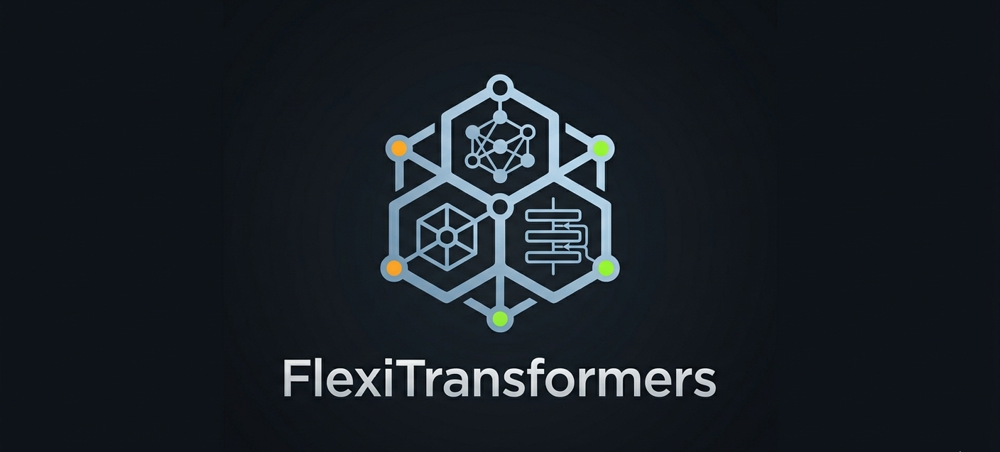

# FlexiTransformers: Modular Transformer Framework



---

[](https://opensource.org/licenses/MIT) [](https://pypi.org/project/flexitransformers/0.3.0/) [](https://www.python.org/downloads/) [](https://pytorch.org/) [](https://a-elshahawy.github.io/FlexiTransformers/) [](https://github.com/astral-sh/ruff)  

---

**Build, experiment, and innovate with transformers.** FlexiTransformers is a modular Python library for constructing and training transformer models. Choose from encoder-decoder, encoder-only (BERT-style), and decoder-only (GPT-style) architectures, plug in any of 6 positional encoding schemes, and extend the library with your own components.

> *This library is primarily designed for educational purposes — flexible enough to understand and easy enough to extend.*

---

## Features

- **3 architectures** — Encoder-Decoder (T5/BART), Encoder-Only (BERT), Decoder-Only (GPT)
- **6 positional encodings** — Sinusoidal, Learned, Rotary (RoPE), ALiBi, Relative, Relative+Bias
- **Pluggable PE system** — `register_pe("name", MyPE)` to add custom encodings at runtime
- **KV cache** — efficient autoregressive inference with per-layer key/value caching
- **Sampling strategies** — greedy, temperature, top-k, nucleus (top-p)
- **Training utilities** — `Trainer`, `LossCompute`, `LabelSmoothing`, `run_epoch`, callbacks
- **Fully typed** — mypy-checked, ruff-formatted, pre-commit enforced

---

## Installation

```bash
pip install flexitransformers
```

Latest development version:

```bash
pip install git+https://github.com/A-Elshahawy/flexitransformers.git
```

**Import the library as `flexit`.**

---

## Quick Start

### Decoder-Only (GPT-style)

```python
from flexit import FlexiGPT, greedy_decode
import torch

model = FlexiGPT(vocab_size=32000, d_model=512, n_heads=8, n_layers=6, d_ff=2048)

src = torch.randint(0, 32000, (1, 10))
out = greedy_decode(model, src, src_mask=None, max_len=50, start_symbol=1)
print(out.shape)  # [1, 59]  (10 prompt + 49 generated tokens)
```

### Encoder-Only (BERT-style)

```python
from flexit import FlexiBERT
import torch

model = FlexiBERT(vocab_size=32000, d_model=512, n_heads=8, n_layers=6,
                  d_ff=2048, num_classes=2)
x = torch.randint(0, 32000, (4, 64))
mask = (x != 0).unsqueeze(1).unsqueeze(2)
logits = model(x, mask)
print(logits.shape)  # [4, 2]
```

### Advanced Config (Encoder-Decoder)

```python
from flexit import ModelConfig, create_model

config = ModelConfig(
    model_type='encoder-decoder',
    src_vocab_size=32000,
    tgt_vocab_size=32000,
    d_model=512,
    n_heads=8,
    n_layers=6,
    d_ff=2048,
    pe_type='rotary',   # absolute | learned | rotary | alibi | relative | relative_bias | none
    dropout=0.1,
)
model = create_model(config)
```

---

## Architectures

| Architecture | Convenience Class | Config `model_type` | Typical Use |
| --- | --- | --- | --- |
| Encoder-Decoder | `FlexiTransformer` | `"encoder-decoder"` | Translation, summarization |
| Encoder-Only | `FlexiBERT` | `"encoder-only"` | Classification, NER, embeddings |
| Decoder-Only | `FlexiGPT` | `"decoder-only"` | Language modeling, generation |

All three are also accessible via `create_model(config)` through `TransformerFactory`.

---

## Positional Encodings

| Name | `pe_type` | Injected at | Representative models |
| --- | --- | --- | --- |
| Sinusoidal | `"absolute"` | Embedding | Vaswani et al. 2017 |
| Learned | `"learned"` | Embedding | BERT, GPT-2 |
| Rotary (RoPE) | `"rotary"` | Q/K projections | LLaMA, GPT-NeoX |
| ALiBi | `"alibi"` | Attention scores | MPT, BLOOM |
| Relative | `"relative"` | Attention scores | Transformer-XL |
| Relative+Bias | `"relative_bias"` | Attention scores | T5 |
| None | `"none"` | — | Ablations |

### Custom PE Plugin

```python
from flexit import register_pe
from flexit.attention.positional import PositionalEncoding

class NoPE(PositionalEncoding):
    @property
    def injection_point(self):
        return "embedding"

    def apply_to_embedding(self, x):
        return x  # pass-through

register_pe("nope", NoPE)

config = ModelConfig(..., pe_type="nope")
model = create_model(config)
```

---

## Inference

```python
from flexit import greedy_decode, sample_decode

# Greedy decoding
out = greedy_decode(model, src, src_mask=None, max_len=50, start_symbol=1)

# Nucleus (top-p) sampling with temperature
out = sample_decode(model, src, src_mask=None, max_len=50, start_symbol=1,
                    temperature=0.8, top_p=0.9)
```

Standalone samplers operate on logit tensors directly:

```python
from flexit import temperature_sample, top_k_sample, top_p_sample

next_token = temperature_sample(logits, temperature=0.7)
next_token = top_k_sample(logits, k=50, temperature=1.0)
next_token = top_p_sample(logits, p=0.9, temperature=0.8)
```

---

## Training

```python
from flexit import (
    ModelConfig, create_model,
    Trainer, LossCompute, LabelSmoothing,
)
import torch

config = ModelConfig(model_type='decoder-only', vocab_size=32000, d_model=512,
                     n_heads=8, n_layers=6, d_ff=2048)
model = create_model(config)

criterion = LabelSmoothing(size=32000, padding_idx=0, smoothing=0.1)
loss_fn = LossCompute(generator=model.generator, criterion=criterion, model=model)
optimizer = torch.optim.Adam(model.parameters(), lr=3e-4, betas=(0.9, 0.98))

trainer = Trainer(
    model=model,
    optimizer=optimizer,
    loss_fn=loss_fn,
    train_dataloader=train_loader,
    val_dataloader=val_loader,       # optional
)
metrics = trainer.fit(epochs=10)
print(metrics.to_dict())
```

### Callbacks

```python
from flexit import CheckpointCallback, EarlyStoppingCallback

trainer = Trainer(
    ...,
    callbacks=[
        CheckpointCallback(save_dir="checkpoints/", monitor="val_loss"),
        EarlyStoppingCallback(patience=3, monitor="val_loss"),
    ],
)
```

---

## Examples

See the [`examples/`](examples/) directory for end-to-end runnable scripts:

| File | What it demonstrates |
| --- | --- |
| [`01_quick_start.py`](examples/01_quick_start.py) | `FlexiGPT`, `FlexiBERT`, `FlexiTransformer` in 3 lines each |
| [`02_manual_config.py`](examples/02_manual_config.py) | `ModelConfig` + `create_model` for all 3 architectures |
| [`03_positional_encodings.py`](examples/03_positional_encodings.py) | All 6 PE types end-to-end + `create_pe` factory |
| [`04_encoder_only.py`](examples/04_encoder_only.py) | Classification heads (BERT-style) |
| [`05_encoder_decoder.py`](examples/05_encoder_decoder.py) | Seq2seq training loop |
| [`06_decoder_only.py`](examples/06_decoder_only.py) | LM training + greedy decoding |
| [`07_output_heads.py`](examples/07_output_heads.py) | `LMHead` weight tying, all head types |
| [`08_save_load.py`](examples/08_save_load.py) | `model.save()` / `Model.load()` round-trip |
| [`09_custom_pe.py`](examples/09_custom_pe.py) | `register_pe` plugin with custom PE class |

---

## API Reference

### Models

| Symbol | Description |
| --- | --- |
| `FlexiGPT` | Decoder-only convenience constructor |
| `FlexiBERT` | Encoder-only convenience constructor |
| `FlexiTransformer` | Encoder-decoder convenience constructor |
| `DecoderOnlyModel` | Full decoder-only model class |
| `EncoderOnlyModel` | Full encoder-only model class |
| `EncoderDecoderModel` | Full encoder-decoder model class |
| `BaseModel` | Abstract base with `save()` / `load()` |
| `TransformerModel` | Generic model via factory |

### Config & Factory

| Symbol | Description |
| --- | --- |
| `ModelConfig` | Dataclass for all model hyperparameters |
| `create_model(config)` | Build a model from `ModelConfig` |
| `TransformerFactory` | Lower-level factory class |

### Attention

| Symbol | Description |
| --- | --- |
| `MultiHeadAttention` | Unified MHA with pluggable PE + KV cache |

### PE Classes

| Symbol | Description |
| --- | --- |
| `SinusoidalPE` | Fixed sinusoidal (embedding-level) |
| `LearnedPE` | Learned position embeddings |
| `RotaryPE` | RoPE applied to Q/K |
| `ALiBiPE` | Linear bias on attention scores |
| `RelativePE` | Relative position representations |
| `RelativePEWithBias` | T5-style scalar relative bias |
| `create_pe(config)` | Factory: config → PE instance |
| `register_pe(name, cls)` | Register a custom PE class |

### Core Components

| Symbol | Description |
| --- | --- |
| `Embeddings` | Token embedding with scaling |
| `EmbeddingWithPE` | Token embedding + positional encoding |
| `FeedForward` | Standard FFN (ReLU / GELU / SiLU) |
| `GLUFeedForward` | Gated linear unit FFN (SwiGLU style) |
| `Generator` | Final linear + softmax projection |
| `LayerNorm` | Standard layer normalization |
| `RMSNorm` | Root-mean-square normalization |

### Layers & Blocks

| Symbol | Description |
| --- | --- |
| `EncoderLayer` | Self-attention + FFN encoder layer |
| `CausalDecoderLayer` | Masked self-attention + FFN decoder layer |
| `CrossAttentionDecoderLayer` | Self-attention + cross-attention + FFN layer |
| `SublayerConnection` | Residual + norm wrapper |
| `Encoder` | Stack of `EncoderLayer` |
| `CausalDecoder` | Stack of `CausalDecoderLayer` |
| `CrossAttentionDecoder` | Stack of `CrossAttentionDecoderLayer` |

### Output Heads

| Symbol | Description |
| --- | --- |
| `LMHead` | Language model head (supports weight tying) |
| `BertHead` | BERT pooler + classifier |
| `SequenceClassificationHead` | CLS-token classification |
| `TokenClassificationHead` | Per-token classification (NER) |

### Inference API

| Symbol | Description |
| --- | --- |
| `greedy_decode` | Greedy autoregressive generation |
| `sample_decode` | Generation with temperature + top-k/p sampling |
| `temperature_sample` | Temperature-scaled sampling on logits |
| `top_k_sample` | Top-k sampling on logits |
| `top_p_sample` | Nucleus (top-p) sampling on logits |

### Training API

| Symbol | Description |
| --- | --- |
| `Trainer` | Full training loop with callbacks and metrics |
| `Batch` | Batching + masking utility |
| `LabelSmoothing` | Label smoothing loss |
| `LossCompute` | Loss wrapper with gradient step |
| `BertLoss` | MLM-style loss for encoder-only |
| `run_epoch` | Single-epoch training/eval loop |
| `Callback` | Base callback class |
| `CheckpointCallback` | Save best/latest checkpoints |
| `EarlyStoppingCallback` | Stop when metric plateaus |
| `TrainerMetrics` | Metrics container returned by `fit()` |

### Utilities

| Symbol | Description |
| --- | --- |
| `subsequent_mask` | Causal (autoregressive) mask |
| `create_causal_mask` | Causal mask from sequence length |
| `create_padding_mask` | Padding mask from token ids |
| `create_combined_mask` | Causal + padding combined |
| `count_parameters` | Count trainable parameters |

---

## Contributing

1. Fork the repository on GitHub
2. Create a feature branch: `git checkout -b feature/your-feature`
3. Develop your changes — follow the existing code style (ruff, mypy, type annotations)
4. Write tests for new functionality
5. Submit a pull request with a clear description of what changed and why

For significant architectural changes, open an issue first to discuss the approach.

---

## License & Credits

Released under the **MIT License**.

Built on PyTorch. Inspired by the original "Attention Is All You Need" paper and the Hugging Face Transformers library.

Developed and maintained by [Ahmed Elshahawy](https://www.linkedin.com/in/ahmed-elshahawy-a42149218/).

---

## Contact

[](https://www.linkedin.com/in/ahmed-elshahawy-a42149218/) [](mailto:ahmedelshahawy078@gmail.com)

Issues and feature requests: [GitHub Issues](https://github.com/A-Elshahawy/flexitransformers/issues)
